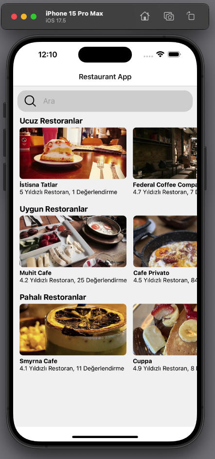

# Restaurant Finder

Restaurant Finder, kullanıcıların API'den alınan restoranları görüntülemesine ve arama yaparak çeşitli yemek türlerini bulmasına olanak tanıyan bir React Native uygulamasıdır. Uygulama, restoranların yıldız değerlendirmelerini ve kaç kişi tarafından değerlendirildiğini gösterir.

## Özellikler

- Restoranları listeleme
- Yıldız değerlendirmeleri ve kullanıcı sayısı
- Restoranlar arasında arama yapma (tost, lahmacun, kebap vb.)
- Modern ve kullanıcı dostu arayüz

## Teknolojiler

- React Native
- Axios (API istekleri için)
- React Navigation
- Vector Icon

## Kurulum

Projenizi yerel ortamda çalıştırmak için aşağıdaki adımları izleyin:

1. Bu depo'yu klonlayın:
   ```bash
   git clone https://github.com/ricoglr/RestaurantApp
   cd RestaurantApp
   ```

2. Gerekli bağımlılıkları yükleyin:
   ```bash
   npm install
   ```

3. Uygulamayı başlatın:
   ```bash
   npm start
   ```

## Kullanım

Uygulamayı başlattıktan sonra, ana ekran üzerinden restoranları görüntüleyebilir ve arama çubuğunu kullanarak istediğiniz yemek türlerini arayabilirsiniz.

## Ekran Görüntüleri


